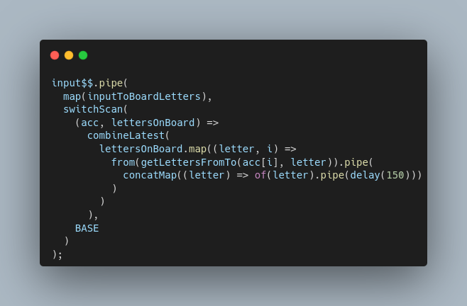

Hello!

In this article, I'm defining an exercise, challenging you to it, and giving my own answer to it.

I'll explain in details my thinking and little spoiler alert, we'll be using operators that are not used very often!

Time to shut down your imperative programming mind and turn on your reactive one. It'll be an interesting ride.

# Intro

If you've been following for me while, you may know by now that I'm a huge RxJS fan. _And if you're not yet following me, it's a really good time to chill a bit and click that follow button before we start melting our brains 🧠🔥!_

So far on dev.to, I've written 3 articles that are either heavily using or completely dedicated to RxJS:

|                                                 |  |  |
| --------------------------------------------------------------------------------------------------------------------------------------------------------------------------------- | -------------------------------------------------------------------------------------------------------------------------------------------------------------------------- | ------------------------------------------------------------------------------------------------------------------------------------------------------ |
| [Brute-forcing an encrypted message from Enigma using the web worker API](https://dev.to/maxime1992/brute-forcing-an-encrypted-message-from-enigma-using-the-web-worker-api-166b) | [Building a reactive microwave for Ryan Cavanaugh with RxJs](https://dev.to/maxime1992/building-a-reactive-microwave-for-ryan-cavanaugh-with-rxjs-3b1a)                    | [RxJS: Avoid an easy mistake when using startWith](https://dev.to/maxime1992/rxjs-avoid-an-easy-mistake-when-using-startwith-4ano)                     |

This one is by far the most challenging of them all.

Recently, we bought at work a [Split flap display](https://en.wikipedia.org/wiki/Split-flap_display), also known as a "Solari board" or "Solari departure board".



The one we got is connected one where we can from an app set the text and it'll update IRL. It's funny to display all kind of important messages or statistics.

I'm sure you know how mesmerizing it can be when all the letters are spinning and suddenly, they all stop, one after another, to display the final sentence. Wouldn't it be a cool challenge to build our own with RxJS?

# Rules of the challenge

Before we get started on this, lets define the expected result:

- **Reactive, reactive, reactive. No imperative programming. Everything should be managed through streams and not rely on external state**. Of course it's fine for example to define the allowed letters in a global variable as a constant. But all the internal state of the app should be self contained in the streams
- 20 letters in total on the display _(easy to change anyway)_
- Can display all the letters from `A` to `Z`, can have spaces between letters/words, and numbers from `0` to `9`
- The page should output the new state of the board whenever one letter is updated
- If the text changes at any point in time, whether there's one ongoing already or if it's currently stopped, it shouldn't start from scratch. Just like in reality, it should continue from where it is currently and roll the letters to the new position

Example of an expected output:

# Challenging you!

Yes you! I think it'd be a lot of fun if people reading this were to give it a go on their own and share how far they got.

In order to make this easier and not dwell on painful setup, I've created a **[Stackblitz template](https://stackblitz.com/edit/rxjs-3x16xb?file=index.ts)** ready to go!

It contains some utility functions in `utils.ts` to manipulate the letters and the DOM, so that we **remain focused on the streams**.

If you decide to give this a go, fork the original Stackblitz or start from scratch if you prefer to. Feel free to modify **anything** from the template I've made. It's just here as a base to help, not here to hold you back.

Don't forget to save your Stackblitz and share it as a comment. Even if you didn't manage to go all the way. Let's discuss the results!

# My solution

In programming, it's likely that there is more than one solution to achieve the same result. So keep in mind that this is my own approach and someone could come up with a different or even better solution.

From now on, be aware that if you want to work on your own solution first, the following will is one possible answer, so it's really a big spoiler ⚠️.

Without further ado, let's jump straight in.

_"Here we gooooooooooooo"._

The first thing I try doing when I have to build a feature that relies on observables, is picture in my head how that should all interact. Outter streams, inner streams. While it may be hard to represent visually, I visualise what I'm trying to build as a mix of [marble diagrams](https://rxjs.dev/guide/operators#marble-diagrams) and pipes that are all connected. I'll do my best to illustrate this but bear with me as this is no easy task.

This is as close as I can represent how things work in a visual way. Now let's dig into the code.

As a reminder, I'm not going to dive into the utils file I've created to manage letters and DOM manipulation. Feel free to take a look [here](https://stackblitz.com/edit/rxjs-3x16xb?file=utils.ts) for the whole implementation.

Now, if we focus on the stream itself and put aside the update of the DOM for now, here's the core of our code:

<!--
input$$.pipe(
  map(inputToBoardLetters),
  switchScan(
    (acc, lettersOnBoard) =>
      combineLatest(
        lettersOnBoard.map((letter, i) =>
          from(getLettersFromTo(acc[i], letter)).pipe(
            concatMap((letter) => of(letter).pipe(delay(150)))
          )
        )
      ),
    BASE
  )
); -->

Before we dig into the specifics, let's contemplate for a second the beauty and the power of RxJS.

Keep in mind that the **14 lines of code** above are capable of displaying a string just like a split-flap board, with animations _(delay applied separately on each letter)_, keep the current state and if the text changes, start changing the letters from exactly where we are to the new position. It also manages correctly if we try to apply a text and change to a different one **while the first one is still running, without resetting from scratch** and picking up exactly where it is 🔥. RxJS is truly a thing of beauty.

The first thing we use is our input. It's a simple `Subject` that we can `next` into whenever we want. This could be bound to an input text for example.

Then, we map that string to an input that'd match the board letters. Meaning, we want it to be an array of chars. One char for each entry of our display. For example, assuming the board supports 10 chars display for simplicity, if we pass `'HELLO'` we'd get back `['H', 'E', 'L', 'L', 'O', '', '', '', '', '']`.

Then 🥁... We use a [`switchScan`](https://rxjs.dev/api/index/function/switchScan), which in all honnestly is the first time I could find a use case for it 🎉. As the name suggests, it's a mix of `switch` and `scan`:

- `switch` means that we'll stop the inner stream if it's still running when the parent stream emits again
- `scan` is like a `reduce`. Meaning it take an accumulator, a current value, and the value you return from it becomes the new accumulator. Except that with `reduce`, it'll wait for the stream to complete before emitting and with `scan` it'll emit all the intermediate results. Here, `switchScan` means that our inner stream will be subscribed to, it'll be able to make multiple emissions that will become the new accumulator, and if the parent streams emits again _(our `input$$` subject)_, we stop changing the letters and start changing again to reach the new string just provided. Here, this operator is doing a fantastic job, it's the key to being able to stop an animation in the middle of it and continue from where the board is currently without resetting

We then have a `combineLatest`. In the diagram I drew above, the `combineLatest` is here to assemble all the streams _(1 per letter)_ that are representend as vertical green arrows.

The build the array of streams that is passed to the `combineLatest`, we loop on the current letters we just received and for each, we compute all the letters in between what we currently have and the target letter for this tile. We then emit each of these intermediate letters that we'll need to go through by using `from`.

Finally, with the `from` emitting all the intermediate letters, we use `concatMap` with a `delay` to make sure we emit the intermediate letters in the same order, with a delay in between each for simulate the animation.

Here's the [final version live in Stackblitz](https://stackblitz.com/edit/rxjs-8vou8y?file=index.ts):



# Conclusion

This was a **lot** to take in, but was an interesting ride. Wasn't it?

Whenever I get the chance to write RxJS code like this, it really reminds me why I love coding. When I found out about reactive programming about 6 years ago, it really blew my mind and I wanted to play with it till I'd be confortable enough to express myself with it, just like most developers are confortable expressing themselves with imperative code that we tend to learn first. Being able to write this now makes me really happy and I try to share that passion for reactive programming whenever possible.

RxJS is a powerful tool and it takes time to learn. But once you manage to wrap your head around it, it's possible to handle really complex use case, in a relatively easy or at least readable way.

---

I hope you enjoyed this article, if you did let me know with a reaction and eventually drop a comment. It's always nice to hear back from people who took the time to read a post 😄! If you gave a go to the challenge yourself, share a link to your Stackblitz or let us know how far you went too!

If you're interested in more articles about Angular, RxJS, open source, self hosting, data privacy, feel free to hit the **follow button** for more. Thanks for reading!

# Found a typo?

If you've found a typo, a sentence that could be improved or anything else that should be updated on this blog post, you can access it through a git repository and make a pull request. Instead of posting a comment, please go directly to https://github.com/maxime1992/my-dev.to and open a new pull request with your changes. If you're interested how I manage my dev.to posts through git and CI, [read more here](https://dev.to/maxime1992/manage-your-dev-to-blog-posts-from-a-git-repo-and-use-continuous-deployment-to-auto-publish-update-them-143j).

# Follow me

| &nbsp;                                                                                                                              | &nbsp;                                                                                                                                           | &nbsp;                                                                                                                                               | &nbsp;                                                                                                                                                    | &nbsp;                                                                                                                                                                | &nbsp;                                                                                                                                                                                     |
| ----------------------------------------------------------------------------------------------------------------------------------- | ------------------------------------------------------------------------------------------------------------------------------------------------ | ---------------------------------------------------------------------------------------------------------------------------------------------------- | --------------------------------------------------------------------------------------------------------------------------------------------------------- | --------------------------------------------------------------------------------------------------------------------------------------------------------------------- | ------------------------------------------------------------------------------------------------------------------------------------------------------------------------------------------ |
|  |  |  |  |  |  |

# You may also enjoy reading

|  |  |
| ------------------------------------------------------------------------------------------------------------------------------------------------------------------------------------------------------------------------------------------------------------------------------------- | ---------------------------------------------------------------------------------------------------------------------------------------------------------------------------------------------------------------------------------------------------------------------------------------------- |
| [The holy grail of note-taking: Private data, efficient methodology and P2P encrypted sync across all your devices](https://dev.to/maxime1992/the-holy-grail-of-note-taking-private-data-efficient-methodology-and-p2p-encrypted-sync-across-all-your-devices-1ih3)                   | [Paperless-ngx, manage your documents like never before](https://dev.to/maxime1992/paperless-ngx-manage-your-documents-like-never-before-2a3n)                                                                                                                                                 |
